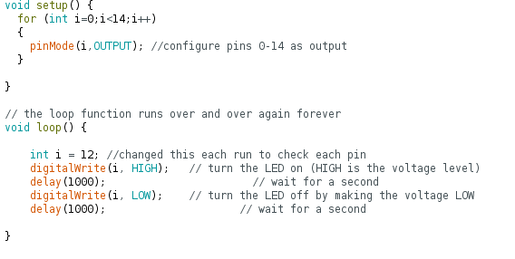

## About Us

We're Team 10, better known as **Earth Wind, and Wire**.

This team is a part of The ECE 3400 Lab Section 404 at Cornell University.

See how we're spending time on our [Team Minutes Page](Mnutes.md)

##### Members:  
Maria Bobbett  
Joshua Diaz  
Tejas Advait  
Jennifer Fuhrer  
Leandro Dorta Duque  
Yixuan Wang  

The members of this group are bound by the [Team Contract](Contract.md). 

## Lab 1: Microcontroller
Lab 1 was most of the Team 10 members' first experience with robotics.
### The Goal

The goal of this introductory lab section was to get familiarized with the different functionalities of the Arduino Uno and the Arduino IDE. Our team had the opportunity to construct a simple functional Arduino program using multiple external components and the Arduino Uno. Once we had this basic understanding, we proceeded to assembly the robot and made it perform an autonomous task such as driving a square path.

#### Materials

- 1 Arduino Uno
- 1 USB A/B cable
- 1 Continuous rotation servos
- 1 Pushbutton
- 1 LED (any color except IR!)
- 1 Potentiometer
- Several resistors (kΩ range)
- 1 Solderless breadboard

### Blink
This being the first time that most team members have experimented with an Arduino, we began by uploading and running the device's most primitive sketch - "Blink".

#### Let's Take This Outside

First, we ran the Blink sketch to verify that the Arduino board and internal LED were working. Then we modified the code to blink an external LED, and verified that all of the pins were functioning. 

Code: 

Here's what the external LED looked like set up:  

### Analog Voltage and LED Output
#### Pass the Pot(entiometer)
For the first step of this part, we built a voltage divider circuit using a potentiometer. We then output the analog voltage values controlled by the potentiometer to the serial monitor.

Serial output from potentiometer code: 

#### Modifications
For the second half of this part, we modified the circuit and the code to do an analog to analog conversion so that the brightness of the LED varied linearly with the input voltage. 
 

The PWM frequency of the LED was **490.2 Hz**

Image:

### Parallax Servos
The purpose of this lab boils down to completing some autonomous task performed by a robot. Our robot will be moving in a simple pattern, requiring propulsion. In order to provide this, we will use Parallax Continuous Rotation Servos in tandem with the Arduino Servo.h library.

The servo was attached to the previous potentiometer in order to have the speed at which the servo operates become dependent on its setting. The following code was then uploaded to the arduino:

The code takes the voltage input to the arduino (controlled by the potentiometer) and translates it into a direction and speed for the servo to turn.

A video of the configuration in action can be found here 
### Team 10 Does the Robot
