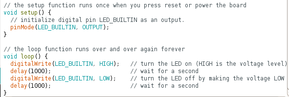
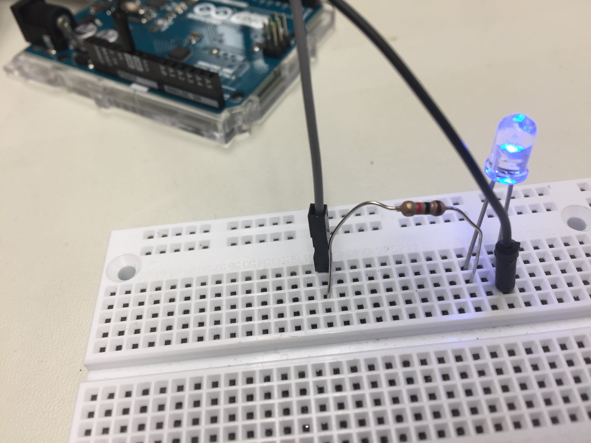
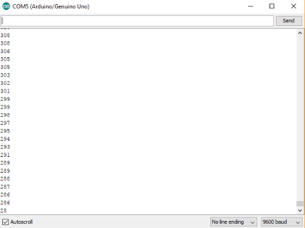
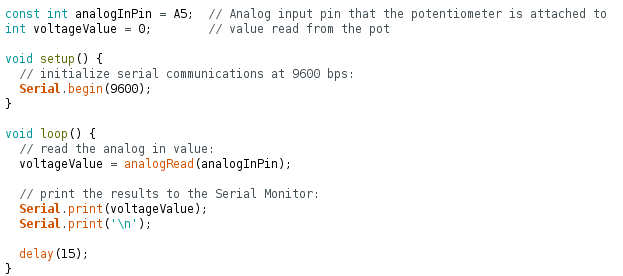
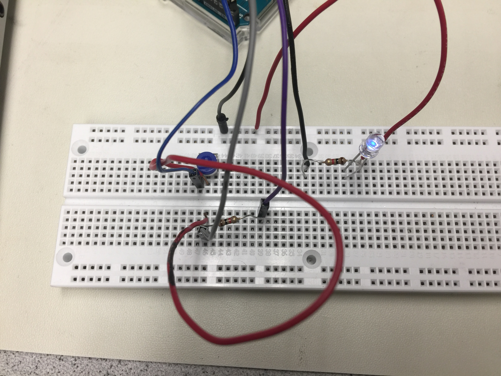
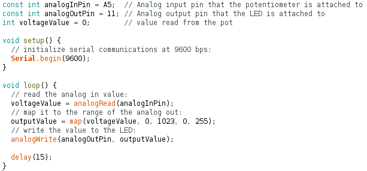
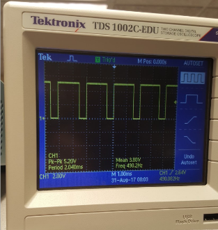
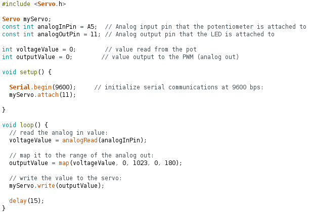
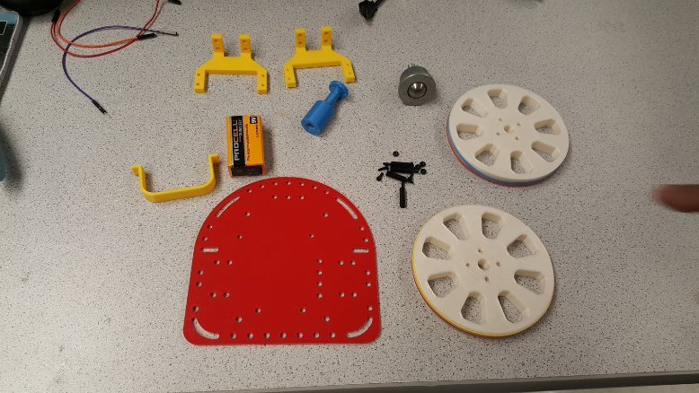
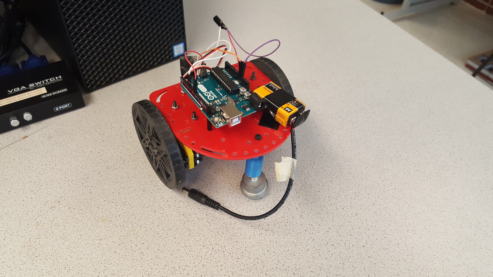

## Lab 1: Microcontroller
Lab 1 was most of the Team 10 members' first experience with robotics.
### The Goal

The goal of this introductory lab section was to get familiarized with the different functionalities of the Arduino Uno and the Arduino IDE. Our team had the opportunity to construct a simple functional Arduino program using multiple external components and the Arduino Uno. Once we had this basic understanding, we proceeded to assembly the robot and made it perform an autonomous task such as driving a square path.

#### Materials

- 1 Arduino Uno
- 1 USB A/B cable
- 1 Continuous rotation servos
- 1 Pushbutton
- 1 LED (any color except IR!)
- 1 Potentiometer
- Several resistors (kΩ range)
- 1 Solderless breadboard

### Blink
This being the first time that most team members have experimented with an Arduino, we began by uploading and running the device's most primitive sketch - "Blink".

#### Let's Take This Outside

First, we ran the Blink sketch to verify that the Arduino board and internal LED were working. Then we modified the code to blink an external LED, and verified that all of the pins were functioning.

Code: 

Here's what the external LED looked like set up:  

### Analog Voltage and LED Output
#### Pass the Pot(entiometer)
For the first step of this part, we built a voltage divider circuit using a potentiometer. We then output the analog voltage values controlled by the potentiometer to the serial monitor.

Serial output from potentiometer code: 

#### Modifications
For the second half of this part, we modified the circuit and the code to do an analog to analog conversion so that the brightness of the LED varied linearly with the input voltage.

 

The PWM frequency of the LED was **490.2 Hz**

Image: 

### Parallax Servos
The purpose of this lab boils down to completing some autonomous task performed by a robot. Our robot will be moving in a simple pattern, requiring propulsion. In order to provide this, we will use Parallax Continuous Rotation Servos in tandem with the Arduino Servo.h library.

The servo was attached to the previous potentiometer in order to have the speed at which the servo operates become dependent on its setting. The following code was then uploaded to the arduino:

The code takes the voltage input to the arduino (controlled by the potentiometer) and translates it into a direction and speed for the servo to turn.

A video of the configuration in action can be found below (click) 

<iframe width="560" height="315" src="https://www.youtube.com/embed/RKeNJGQvyiw?rel=0" frameborder="0" allowfullscreen></iframe>

### Team 10 Does the Robot
 

<iframe width="560" height="315" src="https://www.youtube.com/embed/w1iMTuMnZG8?rel=0" frameborder="0" allowfullscreen></iframe>

To wrap up this lab, we began assembling our robot. For this part, we used the following materials:
- Chassis
- Screws
- 9V battery with clip
- Ball bearing
- 2 wheels
- Allen key

We started mounting the motors onto the motor brackets and then attaching them to the bottom part of the chassis. After this, we installed the wheels and placed the Arduino Uno and the 9V battery on the top side of the base plate. At first, we were using the breadboard for the circuit but we realized that it was better to connect the motors directly to the pins in the Arduino Uno. However, in the future we have to figure out a way to colocate the breadboard on the chassis since we will need it to connect other electrical components such as the sensors.

To make our robot perform an autonomous task, we basically created two Arduino programs: the first one made the robot drive in a straight line and the second one offered it the capacity to trace a square pattern. Although these behaviors can be considered as autonomous, they do not make our robot an “intelligent physical system” yet. As we advance with the lab sections and we start adding some sensors to our robot, it will progressively gain the capacity to interact with the environment, what will make it more intelligent.  

<iframe width="560" height="315" src="https://www.youtube.com/embed/PooEK1s3c94?rel=0" frameborder="0" allowfullscreen></iframe>

### Conclusion
-In this lab, most of us got the chance to work with Arduino Uno and the Arduino IDE for the first time and constructed simple Arduino programs with extra components. We successfully assembled an autonomous robot that could perform simple tasks like driving a square path. This robot is not yet able to perform more intelligent actions like following a routine. With the help of sensors and more algorithms, we will turn it into an intelligent system with the ability to react upon its environment in the future.
## Website Sections:
 

[1. Milestones](documents/)
[2. Labs](labs/labsessions.md)
