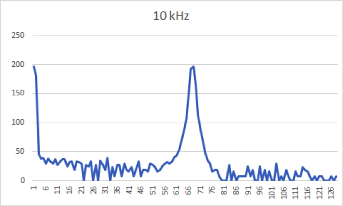
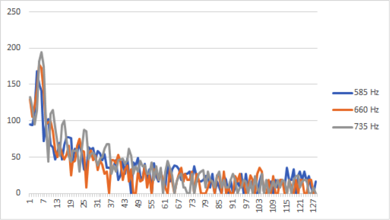

## Lab 2: Analog Circuitry and FFTs

### Objective
Now that we’ve got our robot moving, we want it to be able to sense the surrounding environment. In this lab, we were working with a 
microphone to detect the 660 Hz start signal and an IR sensor to identify treasures of different frequencies.

#### Materials
- Arduino Uno
- Electret microphone
- IR receivers
- Treasure board
- Resistors
- Capacitors
- Op amps

### Part 1: FFTs

In this lab, we needed to be able to distinguish between signals of different frequencies. We used the Fast Fourier Transform (FFT) 
algorithm in Open Music Lab’s FFT library to accomplish this. A Fourier transform takes a signal in the time domain and breaks it down 
into its component frequencies. An FFT works by splitting an N point time domain signal into N individual time domain signals, calculating 
the frequency spectra of each, and then merging them into a single frequency spectrum. This is a sped-up version of a Discrete Fourier 
Transform (DFT).

For this lab, we used Open Music Labs’ FFT library to analyze the signals from our sensor. After downloading and installing the library, we
opened up the fft_adc_serial.ino sample code to get a better understanding of how the library worked. This program takes 256 samples from 
the ADC and places them in even bins (odd bins are used for the complex signal components - since we are only dealing with real signals, 
odd bins are excluded). The program then processes the data in the fft and sends it out over the serial monitor, in the form of a histogram.
Each bin represents a frequency range, determined by the ADC clock frequency.

To verify that the library was working as expected, we hooked our adc up to a function generator and tested it using a 10 kHz signal.

The peak occurs at bin 68, pretty close to the expected bin of 66. Our prescaler was set to 32, giving us an ADC clock frequency of 500  kHz (16 MHz/ 32), and a sampling frequency of 500kHz/13 = 38 kHz. Each bin is about 150 Hz wide, and 10k/150 = 66.

### Part 2: Acoustic Team
The microphones we used came with a built in circuit, show below.

To test the microphone, we hooked it up to an oscilloscope and used an app to generate a 660 Hz tone. The output was a ~612 Hz sinusoid with a ~1 V peak to peak amplitude. 

Since we only needed to detect a 660 Hz tone, we can use a smaller sampling frequency. We modified the sample code, setting the prescaler to 64. 

With this sampling frequency, we would expect to see peaks for 585 Hz, 660 Hz, and 735 Hz signals in bins 7, 8, and 9, respectively.

The peaks were actually in bins 5, 6, and 7 respectively. This could potentially be due to inaccuracies in our tone generator.
We also designed a band pass circuit to filter out frequencies below 500 Hz and above 800 Hz, but didn’t think it would be necessary during the competition, since the FFT algorithm neatly sorts the frequencies for us.

