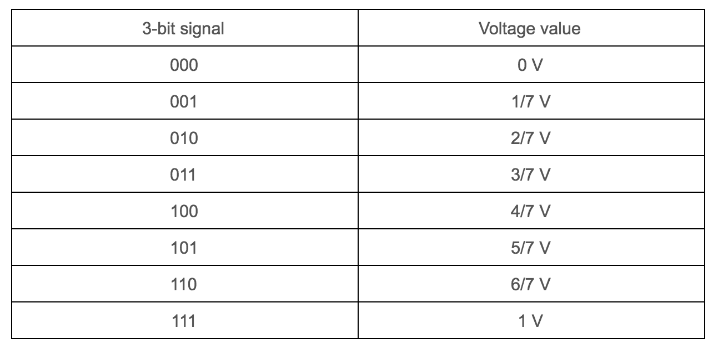
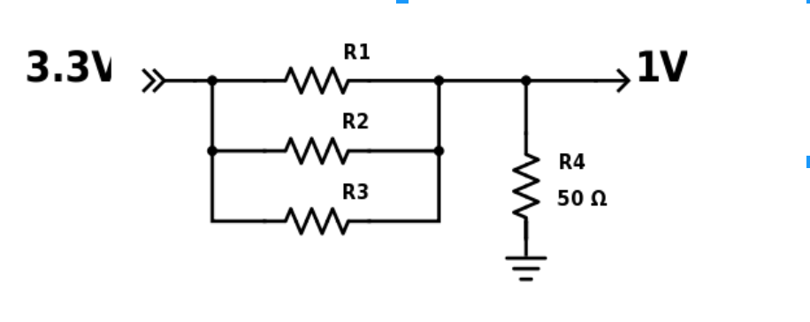
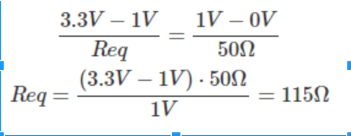
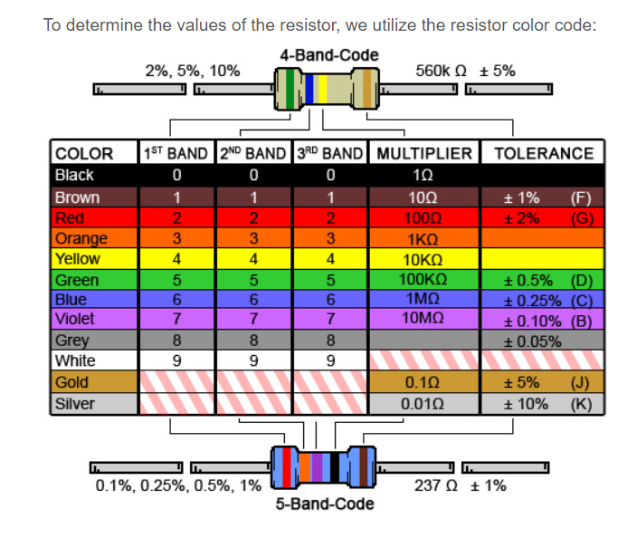
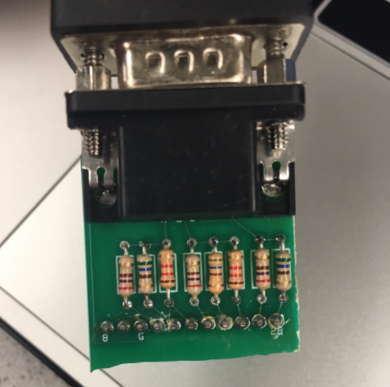
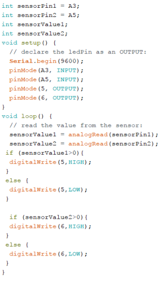
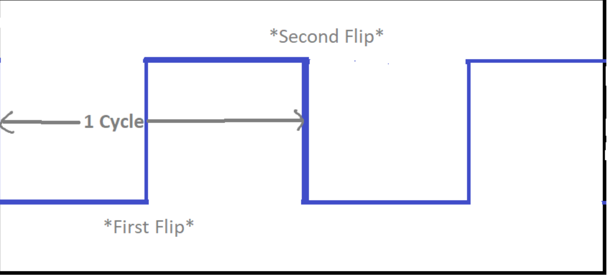
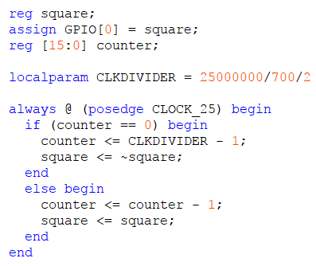
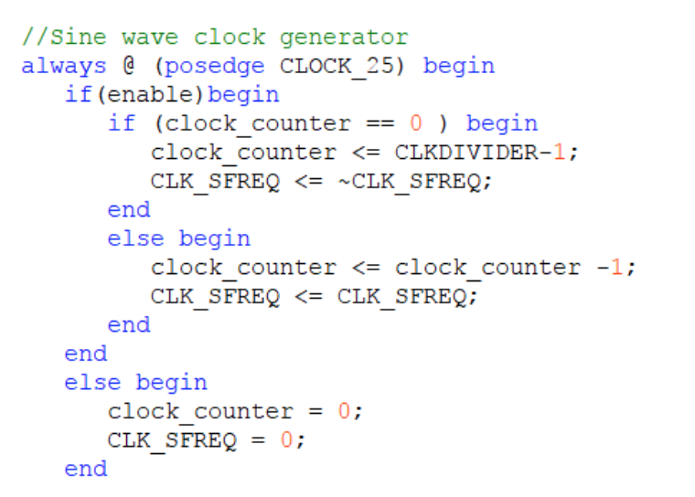
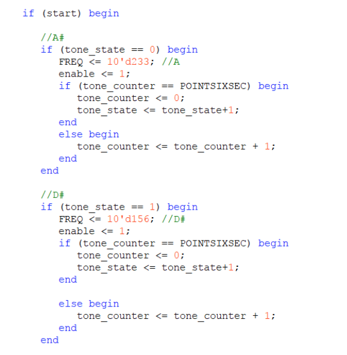

## Lab 3: FPGA Video Controller and Sound Generation

### Objective
This lab activity is divided into two projects. One team must take at least two external inputs to the FPGA and display them on a screen. The other team will react to an external input to the FPGA of their choice and generate a short “tune” consisting of at least three different tones to a speaker via an 8-bit DAC. These two tasks represent a good practice towards the final competition, since all the maze information detected by our robot must be processed by the basestation Arduino, transmitted to the FPGA  and finally drawn on a VGA monitor. Once our robot has completely mapped the maze, the FPGA must generate a short tune to be played on a speaker to indicate that maze-mapping is done. 

### Graphics Team
 Maria Bobbett, Leandro Dorta Duque, Tejas Advait

#### Materials
- 1 VGA Monitor
- 1 VGA Cable
- 1 VGA Connector
- 1 VGA Switch
- Multiple resistors
- 2 external switches

#### Overview
During the final competition, our robot must be able to detect all maze information which will be displayed in a monitor. In order to achieve this functionality, we must construct a communication system that consists of: an Arduino, which processes the information detected and transmits it to an FPGA, and an FPGA which conveys the information to the VGA monitor where it is graphically displayed. A VGA monitor works with two synchronization signals and three analog color inputs (Red Green Blue). It works by looping through all the pixels on the screen as determined by the synchronizing clock signals. In each cycle, the color of the corresponding pixel is determined by the voltage values of the three analog signals. For the completion of this lab activity, we were provided with a VGA module which generates the necessary VGA color signals (8-bit signal: 3 bits for red, 3 bits for green, and 2 bits for blue) and the synchronization signals. This module outputs the x- and y-coordinates for the next pixel and receives as input the corresponding color for this pixel. We have the task to create the logic to determine the color of each pixel location according to what we desire to portray in the screen. Another consideration is that the VGA cable,which serves as the connection between the FPGA and the VGA monitor, only has one wire for red, one wire for green and one wire for blue (analog signals which oscillate between 0 and 1V). To overcome this problem, we use a Digital-to-Analog Converter (DAC) which converts the given 8 color bits (with a 3.3V digital output from the FPGA) to the desired three color analog signals. 

####  How the DAC on the Provided VGA Connectors Works and How the Resistor Values were Chosen
As it was mentioned before, we face the problematic situation that the FPGA outputs 8 color bits with the corresponding 3.3V digital signal and the VGA only contains three wires (one wire for red, one for green, one for blue) to read analog color signals (values oscillating from 0 to 1V). Therefore, we need to come up with a solution to map each possible combination of bits to a different value of voltage in order to differentiate them. For example, for color red and green, we have 3 bits, which correspond to 8 different  bit combinations. We need to map each of these combinations to a different value of voltage. Taking this in consideration, we come up with the following values: 

In this way, we have a corresponding value of voltage to each bit combination. These values apply for red and green. Let’s see the same analysis for blue color:

We can obtain these different values of voltage by applying voltage division as it is showed in the following schematics:
Red and Green Branches Voltage Divider

 Blue Branch Voltage Divider

In the schematics above, we have identified the most significant bit by MSB and the least significant bit by LSB. We have also represented the 50 ohm internal resistor of the VGA cable. Now, we have to determine the values for each resistor. Let’s start with the Red and Green Branches: 
 - We first rearrange the schematic so it is easier to apply the node-voltage method. 

 - We are taking the example where all bits are on and the outputs is 1 V (according to the table above). 
 - Then, we proceed with the calculations:
 
 
 
 - From the table corresponding to the Red and Green Branches, we can notice that the value for the bits starting from the MSB to the LSB    are 4/7 V, 2/7 V and 1/7 V respectively. We can conclude that each bit is half of the other. Therefore, the corresponding resistance      for each bit will follow this structure but in the opposite way. So, the order of the resistances starting from the MSB to the LSB will    be R, 2R, and 4R respectively. Taking this in consideration, we are now able to calculate the values of the resistor since we have the    equivalent resistance: 

We apply the same operations to the blue branch:

The following table resumes the obtained results:

These values correspond to the minimum resistance that we need for each bit in its corresponding branch in order to obtain 1V as the maximum voltage for the output of the VGA connector (and the input of the VGA cable). If we use lower values of resistance, the signal will be able to reach values greater than 1V which can be problematic for our VGA monitor. However, we can use higher values of resistance as long as the value for the output signal is between 0 and 1V. Now, let’s analyze the values of the resistors of our VGA connector to see if they meet the requirements: each resistor is approximately doubling the value of its previous bit’s resistance and the value of the final output is between 0 and 1V. 

And here is a picture of the VGA connector we use:

These are the corresponding values:

At first sight, we can notice that each value of resistance for each bit is greater than its corresponding in the analysis we did before. Also, they meet the requirement that each value is approximately doubling the value of the previous bit. Let’s make the calculations to see if the values of the output signals oscillate between 0 and 1 V. 

As we can see, the voltage values are between 0 and 1V. Therefore, the values for the resistors are correctly chosen as we analyzed before. 

###  Drawing One Box On The Screen

Once we understood how the VGA connector worked, we hooked up our FPGA and uploaded the template code. We first set the screen color to purple.

 
Once we successfully set the screen color, we wrote code to draw an Italian flag in the center of the screen.

 

 
 
 
### Reading external inputs to the FPGA
#### Correctly updating a 4-bit array dependent on the inputs
In this part of the lab, we connect two external switches to the Arduino Uno and connect the Arduino to the FPGA. The plan is to establish the communication between the Arduino and the FPGA, so the Arduino process the maze information and sends the signal to the FPGA which portrays it into the VGA screen. We connect the two switches to two analog pins in the Arduino in order to read their outputs. Then, the Arduino will send two digital signals (each corresponding to each switch) to indicate if the switch is on or off. Then, the FPGA will output the corresponding graphics for each case. The following corresponds to our Arduino code:
 
 
 
 The Arduino output signal is of 5V and the input signal that the FPGA receives is of 3.3V. Therefore, we must step down the signal from the Arduino before connecting it to the FPGA. To achieve this, we use a voltage divider using the values of 1kΩ and 500Ω. 
 
 
 
Once we have the appropriate Arduino outputs set up, we can connect them to the GPIO pins in the FPGA. Our FPGA will update the configuration of colors according to the values obtained from the Arduino which indicates the states of the switches. We establish the relations as follow: 
The values for each quadrant correspond to the combination of Switch_1 Switch_2. For example, in order to highlight the top right corner, Switch_1 = 0 and Switch_2 = 1.

The connection between the switches, the Arduino and the FPGA where you can also see the voltage divider utilized.
The graphics our code portrays on the screen corresponds to a white square which is divided in the four quadrants described above. The selected quadrant according to the values of the switch becomes red, and the rest of the screen  is black. The following corresponds to the code to achieve this functionality: 

This portion of code updates the color for the next pixel location accordingly. As we want to create a 100-by-100 px square, we establish that any pixel location greater than that will be colored black. Then, if the pixel is within that area, it will receive its color according to the mapping we establish which is described in the next section. 

#### Mapping external inputs to four different outputs on the screen
The following fragment of code shows how we map external inputs to four different outputs. The external inputs, which correspond to the values of the switches are stored by the variables switch_1 and switch_2. Also, we create a grid that (4-bit array) to map each quadrant to its corresponding color according to each situation. We can follow the code to see that it follows the idea we described before about how the relation between the switches and the highlighted quadrant is. 

In the following video, we can see how our code successfully works: 
<iframe width="560" height="315" src="https://www.youtube.com/embed/PbsCtGimTn4" frameborder="0" allowfullscreen></iframe>

### Acoustics Team
Yixuan Wang  Joshua Diaz  Jennifer Fuhrer

#### Materials
- 1 Audio Socket
- 1 8-bit DAC
- 1 lab speaker

#### Overview
For the final competition, our robot is required to generate a short tune to be played on a speaker to signify that the mapping is done. To do this, the acoustic team made use of an FPGA that will generate a minimum of 3 sequential tones.

#### Setting up the DAC
The goal was to eventually use many different  voltages ranging from 0 to 3.3V to create a sine wave signal, which requires multiple bits. Feeding those alternating bits directly into the audio jack makes no physical sense to the speakers, so we needed to translate our 8-bit number outputted by the FPGA to a singular voltage. We used an 8-bit R2R DAC to convert the digital signal to an analog voltage.

This DAC uses a scheme of resisters colloquially known as a resistance ladder. This ladder has eight “rungs”, one for each bit input (see above figure). The most significant bit and the output are at leftmost end, while the least significant bit is at the rightmost end. This is because between each bit is a voltage divider, and each divider contributes to the overall voltage found at the leftmost end of the resistance ladder. This acts just like the bits would because the more significant bits give more voltage or “value” to the overall voltage because they have less resistance on their voltage divider, making their value greater. Using this scheme, the eight bits are converted into a single overall voltage which the speaker can read and translate into sound (if the bits alternate values in a certain frequency).
For our circuit, initially for the square wave, we only connected GPIO_00 to pin 1 for the single bit. Then for the sine wave, we connected DAC pins 1 through 8 to the FPGA pins GPIO_00 through GPIO_07 respectively. The output to the speaker was DAC pin 16, and we used the FPGA’s pin 12 for the common ground.

#### Squares are Simple

Getting started with signal generation on the DE0-NANO board that we were provided, the team chose to generate a square wave at 700Hz. Square waves are simple as they boil down to negating (flipping) a 1 bit signal 2 * 700 times per second, or once every 1/1400 seconds. The reason we flip twice is because a single cycle encompases of a high and a low signal.

However, the clock our logic is running at is 25 MHz, meaning it flips twice every 1/25000000 seconds. In order to make this transformation, we require figuring out how many 25 MHz cycles equate to a single cycle of some desired frequency ƒ

Meaning we want to count through (25000000/f)/2 25MHz cycles before flipping our output bit. To achieve this we implement a counter with the above value that decrements once per 25 MHz cycle. Each time the counter reaches 0, the output bit flips and the counter is reset, thus restarting the cycle.

We chose to output this value from GPIO_0 pin 0 using pin 12 as ground. The output can be seen on an oscilloscope as shown below

Note that we left the code simple to edit so that we may output a square wave of ANY frequency by changing only one local parameter.

#### IT’S A SINE
Although we can generate any square wave we could ever possibly want, let’s face it, squares are boring. We extend the types of sounds we output to sine waves
##### Generating a ROM Table
We used a python script to generate 256 values of a full sine wave of amplitude 100, round them to the nearest whole number, then print it in verilog syntax so it would be a ROM table in our program we could pull from it elsewhere in our code.

However, this created some negative values, which made the sine wave look something like this:

Therefore, we had to add 100 to the values to make them all positive and the wave (of 700 Hz). Which turned out better:

Revised code (just added 100 to the sine wave):

Then we just copied the sineTable text file into our verilog script, that will be later uploaded to the FPGA.

In order to control the frequency, we used a register value FREQ in our code to define the frequency in hertz. Then, to actually create the sine wave in that frequency, we used two more registers SAMPLING_FREQ and CLKDIVIDER to create the wave. SAMPLING_FREQ was used to create the clock that would cycle through the ROM table at 256 times our desired frequency. This clock is created by CLKDIVIDER, which is the value of the system clock (25 MHz) divided by the sampling frequency, divided by two. This exists so it can create CLK_SFREQ, which is a pseudo clock that drives the ROM table. Once the ROM table is accessed 256 times, it generates one sine wave. This rate of sine wave generation creates a signal that is at the frequency we specified in FREQ.

After we were able to create a sine wave with a singular frequency, we worked toward creating a sound with multiple tones in a row. This involved creating a state machine. We used the value tone_state, to change between notes and each note resets the tone_counter, which counts up to a desired number of seconds (first was defined for three seconds, then 0.6 to play a song). Once tone_counter gets up to the set number of seconds, then the counter resets and we add 1 to tone_state which moves on to the next note. 

For our first iteration we measured the frequencies with the oscilloscope then played a 3 tone sample. Examples of those can be found here:

<iframe width="560" height="315" src="https://www.youtube.com/embed/5Hot30vIp_Y" frameborder="0" allowfullscreen></iframe>

<iframe width="560" height="315" src="https://www.youtube.com/embed/E3a1a_DGvQ4" frameborder="0" allowfullscreen></iframe> 

### The MJ Cover the World Has Been Waiting For
We were able to play a short part of a song (I Don’t F*CK WITH YOU by Big Sean) with 16 states. A video example can be found here:

<iframe width="560" height="315" src="https://www.youtube.com/embed/XVi_11WXyCY" frameborder="0" allowfullscreen></iframe>
