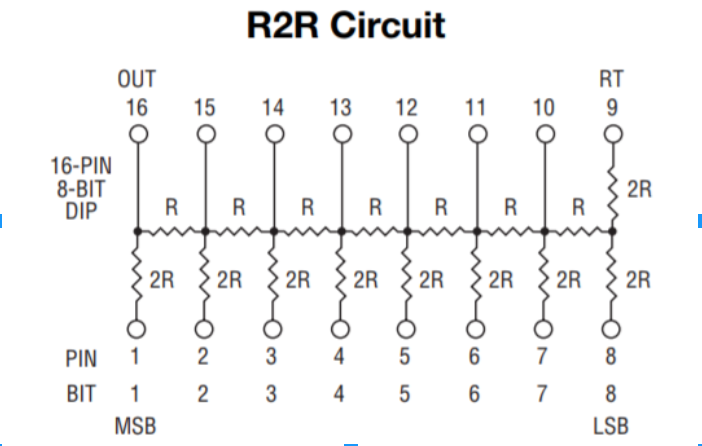
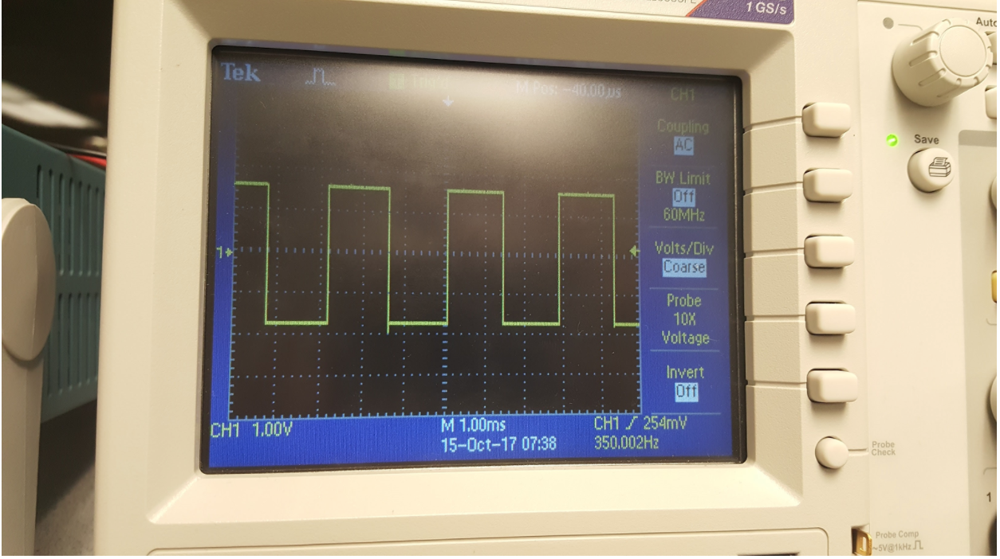
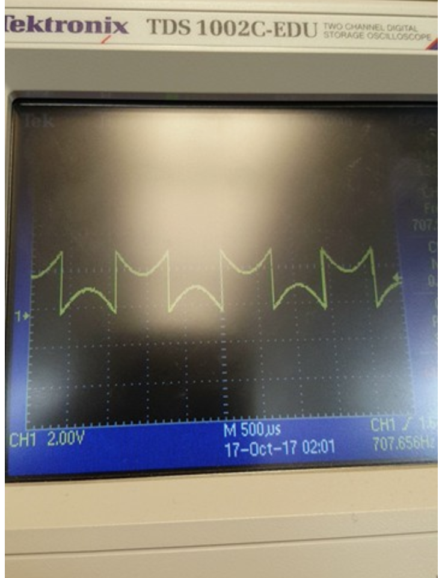
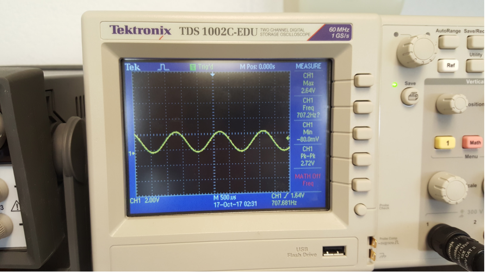

### Graphics Team
Yixuan Wang  Joshua Diaz  Jennifer Fuhrer

#### Materials
- 1 Audio Socket
- 1 8-bit DAC
- 1 lab speaker

#### Overview
For the final competition, our robot is required to generate a short tune to be played on a speaker to signify that the mapping is done. To do this, the acoustic team made use of an FPGA that will generate a minimum of 3 sequential tones.

#### Setting up the DAC
The goal was to eventually use many different  voltages ranging from 0 to 3.3V to create a sine wave signal, which requires multiple bits. Feeding those alternating bits directly into the audio jack makes no physical sense to the speakers, so we needed to translate our 8-bit number outputted by the FPGA to a singular voltage. We used an 8-bit R2R DAC to convert the digital signal to an analog voltage.

This DAC uses a scheme of resisters colloquially known as a resistance ladder. This ladder has eight “rungs”, one for each bit input (see above figure). The most significant bit and the output are at leftmost end, while the least significant bit is at the rightmost end. This is because between each bit is a voltage divider, and each divider contributes to the overall voltage found at the leftmost end of the resistance ladder. This acts just like the bits would because the more significant bits give more voltage or “value” to the overall voltage because they have less resistance on their voltage divider, making their value greater. Using this scheme, the eight bits are converted into a single overall voltage which the speaker can read and translate into sound (if the bits alternate values in a certain frequency).
For our circuit, initially for the square wave, we only connected GPIO_00 to pin 1 for the single bit. Then for the sine wave, we connected DAC pins 1 through 8 to the FPGA pins GPIO_00 through GPIO_07 respectively. The output to the speaker was DAC pin 16, and we used the FPGA’s pin 12 for the common ground.

#### Squares are Simple

Getting started with signal generation on the DE0-NANO board that we were provided, the team chose to generate a square wave at 700Hz. Square waves are simple as they boil down to negating (flipping) a 1 bit signal 2 * 700 times per second, or once every 1/1400 seconds. The reason we flip twice is because a single cycle encompases of a high and a low signal.

However, the clock our logic is running at is 25 MHz, meaning it flips twice every 1/25000000 seconds. In order to make this transformation, we require figuring out how many 25 MHz cycles equate to a single cycle of some desired frequency ƒ

Meaning we want to count through (25000000/f)/2 25MHz cycles before flipping our output bit. To achieve this we implement a counter with the above value that decrements once per 25 MHz cycle. Each time the counter reaches 0, the output bit flips and the counter is reset, thus restarting the cycle.

We chose to output this value from GPIO_0 pin 0 using pin 12 as ground. The output can be seen on an oscilloscope as shown below

Note that we left the code simple to edit so that we may output a square wave of ANY frequency by changing only one local parameter.

#### IT’S A SINE
Although we can generate any square wave we could ever possibly want, let’s face it, squares are boring. We extend the types of sounds we output to sine waves
##### Generating a ROM Table
We used a python script to generate 256 values of a full sine wave of amplitude 100, round them to the nearest whole number, then print it in verilog syntax so it would be a ROM table in our program we could pull from it elsewhere in our code.

However, this created some negative values, which made the sine wave look something like this:

Therefore, we had to add 100 to the values to make them all positive and the wave (of 700 Hz). Which turned out better:

Revised code (just added 100 to the sine wave):

Then we just copied the sineTable text file into our verilog script, that will be later uploaded to the FPGA.

In order to control the frequency, we used a register value FREQ in our code to define the frequency in hertz. Then, to actually create the sine wave in that frequency, we used two more registers SAMPLING_FREQ and CLKDIVIDER to create the wave. SAMPLING_FREQ was used to create the clock that would cycle through the ROM table at 256 times our desired frequency. This clock is created by CLKDIVIDER, which is the value of the system clock (25 MHz) divided by the sampling frequency, divided by two. This exists so it can create CLK_SFREQ, which is a pseudo clock that drives the ROM table. Once the ROM table is accessed 256 times, it generates one sine wave. This rate of sine wave generation creates a signal that is at the frequency we specified in FREQ.

After we were able to create a sine wave with a singular frequency, we worked toward creating a sound with multiple tones in a row. This involved creating a state machine. We used the value tone_state, to change between notes and each note resets the tone_counter, which counts up to a desired number of seconds (first was defined for three seconds, then 0.6 to play a song). Once tone_counter gets up to the set number of seconds, then the counter resets and we add 1 to tone_state which moves on to the next note. 

For our first iteration we measured the frequencies with the oscilloscope then played a 3 tone sample. Examples of those can be found here:

<iframe width="560" height="315" src="https://www.youtube.com/watch?v=5Hot30vIp_Y&feature=youtu.be" frameborder="0" allowfullscreen></iframe>  

<iframe width="560" height="315" src="https://www.youtube.com/watch?v=E3a1a_DGvQ4&feature=youtu.be" frameborder="0" allowfullscreen></iframe>  

We were able to play a short part of a song (I Don’t F*CK WITH YOU by Big Sean) with 16 states. A video example can be found here:

<iframe width="560" height="315" src="https://www.youtube.com/watch?v=XVi_11WXyCY" frameborder="0" allowfullscreen></iframe>  

