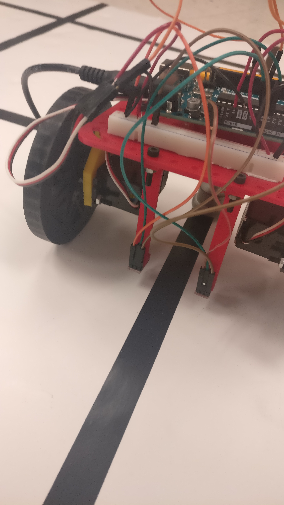

## Milestone 1: Figuring Out Figure 8s
Lab 1 was most of the Team 10 members' first experience with robotics.
### The Goal

For Milestone 1, we have two primary objectives:
- Successfully implement line following - where black tape on a white background represents the line
- Successfully traverse the grid in a figure eight.

#### Materials

- 2x Continuous Servo Motors
- 2x [Analog Line Sensor](https://www.sparkfun.com/products/9453)
- Arduino Uno
- Robot Chassis
- 9V Battery
- Breadboard
- Appropriate Connectors and Headers

### Line Follower
Since our servo motors were calibrated fairly well in Lab, our robot moves in a straight line on the grid, with minimum need for correction.
We attach two sensor at the front of the robot (from Lab 1) as shown below 

We start working on milestone 1 by first testing and calibrating the line sensors. Using the example code, “AnalogReadSerial” in the Basic category, we observed the analog values generated by the sensor when kept on differently colored surfaces. We concluded that a value above 950 corresponds to black color while a value less than 930 corresponds to white color. Any value in between is considered noise since there is no single precise value which distinguishes black tape from the white background.

Now, after establishing the threshold values, we worked on the logic for line following. Our sensors are positioned such that it fits the line in between. If both the sensors detect white, that means the robot doesn’t need any corrective measure, so the robot goes straight. If the left line sensor detects black and the right sensor detects white, then the robot should correct itself by turning a little left. Similarly, when the right line sensor detects black and left line sensor detects white, the robot should correct itself by turning a little right. If both detect black, for the purpose of line following, we program the robot to go straight; however, this would change for the next objective! 
This simple logic is enough to successfully implement line following. 
The following code takes in raw sensor and returns 0 or 1 depending on the threshold values. 

The following code explains the logic for line following in terms of code  

And here’s the video of our line follower robot: 

<iframe width="560" height="315" src="https://youtu.be/UeX_rniHqjw" frameborder="0" allowfullscreen></iframe>

### Figure Eight

### Future Possible Modifications / Notes
- We can possibly incorporate a four sensor arrangement for better control; however, our current iteration works well
- If there is a change in the chassis, the threshold values for the line sensors have to be tested again

### Conclusion
We successfully added line following functionality to our robot from Lab 1. Building further on the line follower robot, we added the functionality of making right angled turns. Using line following and the ability to make right angled turns, we further programmed the robot to move in a figure eight
 
[1. Milestones](documents/)  
[2. Labs](labs/labsessions.md)  
