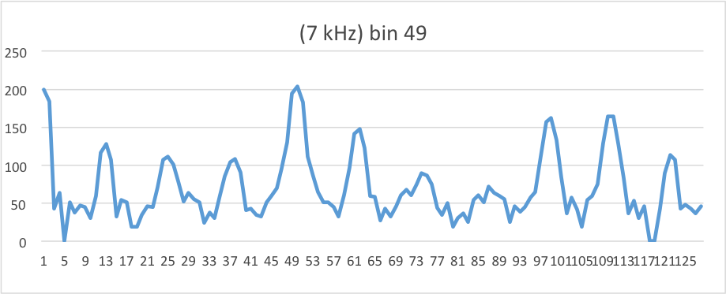
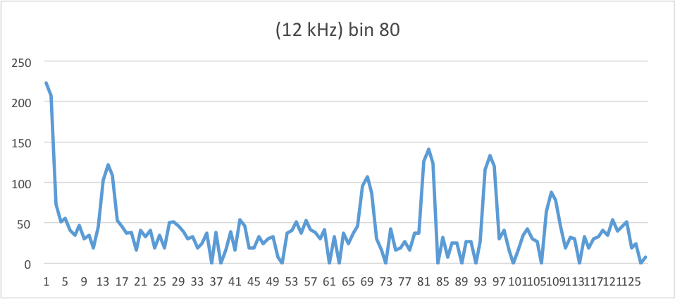
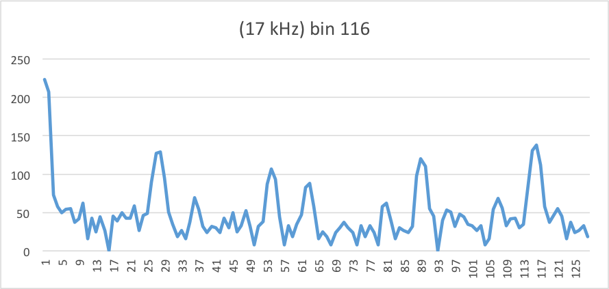
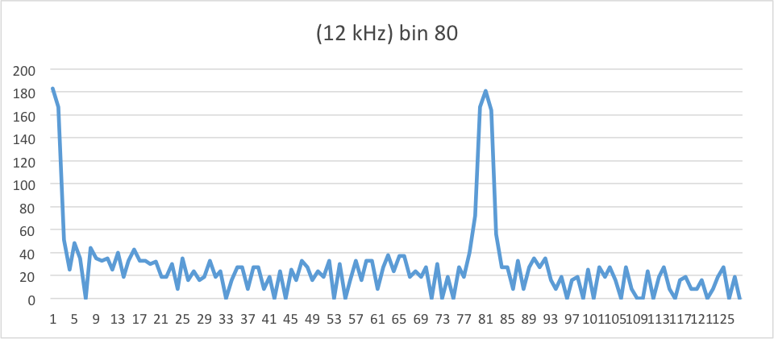
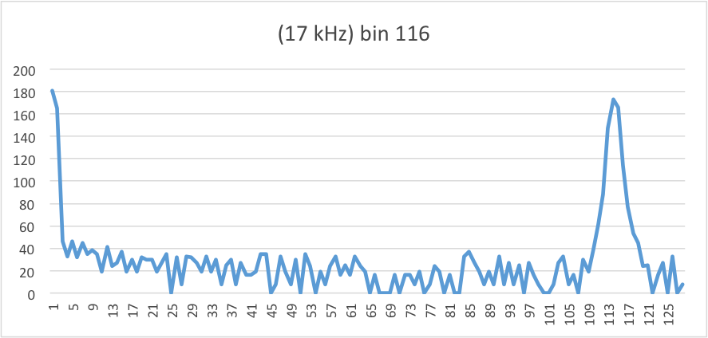
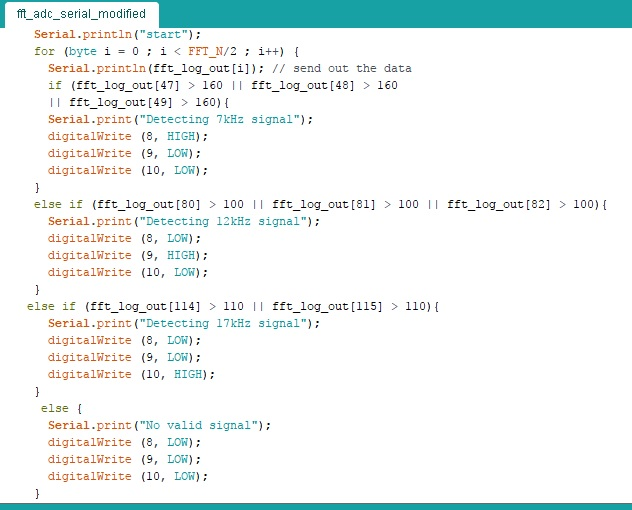
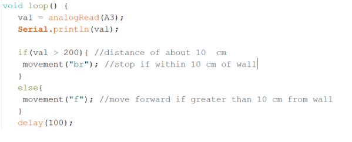

## Milestone 2: Treasure Detection and Wall Detection
### The Goal

For Milestone 1, we have two primary objectives:
- Detect frequencies at 7kHz, 12kHz and 17kHz.
- Autonomously detect walls

### Treasure Detection
The purpose of this part of Milestone 2 is an to extend the range of frequencies that can be detected and classified. Since our Lab 2 optical circuit worked well, the circuit design of detecting different treasures is the same as the one we used in lab2.
Based on our code and the testing frequency, we can figure out right bins to check for in the FFT results, which are also the bins where the highest peaks occur. 
For the 7kHz testing frequency, the highest peaks occurs at bin 46-48. 

For the 12kHz testing frequency, the highest peaks occurs at bin 79-81.

For the 17kHz testing frequency, the highest peaks occurs at bin 116-117.

To confirm our result, we also used the function generator to generator 12kHz and 17kHz sine frequencies like we did for the 7kHz frequency in lab2, and these are the result we had. 

From the above results, we wrote a simple algorithm to classify the FFT results. We used an else-if statement in case that small peaks might lead confusion to the result.

As we can see from the above graphs, it might be helpful to add an analog filter to the circuit in the future. This would be helpful to filter low frequency noises, and enable the FFT to focus on the signal from the IR sensors. 

Below is a video showing our results:
<iframe width="560" height="315" src="https://www.youtube.com/embed/YVQM5f7yCRE" frameborder="0" allowfullscreen></iframe>

### Wall Detection
For wall detection, we mounted an IR short-range distance sensor to our robot. We took the analog output from the sensor and determined a threshold value at which the robot would recognize that it was in front of a wall. For the purpose of this milestone, we  just had the robot stop once it got close enough to the wall.

Code snippet:

And a video:
<iframe width="560" height="315" src="https://www.youtube.com/embed/bVS3Tqpj4TI" frameborder="0" allowfullscreen></iframe>
